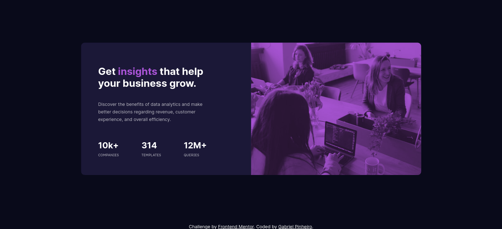

# Frontend Mentor - Stats preview card component solution

This is a solution to the [Stats preview card component challenge on Frontend Mentor](https://www.frontendmentor.io/challenges/stats-preview-card-component-8JqbgoU62). 

## Table of contents

- [Overview](#overview)
  - [The challenge](#the-challenge)
  - [Screenshot](#screenshot)
  - [Links](#links)
- [My process](#my-process)
  - [Built with](#built-with)
  - [What I learned](#what-i-learned)
    - [Useful resources](#useful-resources)
- [Author](#author)

## Overview

### The challenge

Users should be able to:

- View the optimal layout depending on their device's screen size

### Screenshot




### Links

- Solution URL: [https://www.frontendmentor.io/solutions/stats-preview-card-component-challenge-hub-vMcoqeRrY](https://www.frontendmentor.io/solutions/stats-preview-card-component-challenge-hub-vMcoqeRrY)
- Live Site URL: [https://gabrielfmpinheiro.github.io/Stats-preview-card-component/](https://gabrielfmpinheiro.github.io/Stats-preview-card-component/)

## My process

### Built with

- Semantic HTML5 markup
- CSS custom properties
- Flexbox
- Mobile-first workflow

### What I learned


```css
/* Using Pseudo-elements to overlay img and working with mix-blend-mode */
.image-header::after {
  background-image: url("../images/image-header-mobile.jpg");
  background-size: cover;
  mix-blend-mode: multiply;
  opacity: 0.78;
  position: absolute;
}
}
```
### Useful resources

- [Bryan Robinson Channel](https://www.youtube.com/watch?v=SXQ9l0ScDEA) - This helped me for understand how to overlay image with ::after pseudo-elements.

## Author

- Linkedin- [Gabriel Pinheiro](https://www.linkedin.com/feed/)
- Frontend Mentor - [@GabrielFMPinheiro](https://www.frontendmentor.io/profile/GabrielFMPinheiro)
- Codewars - [@GabrielFMPinheiroe](https://www.codewars.com/users/GabrielFMPinheiro)
